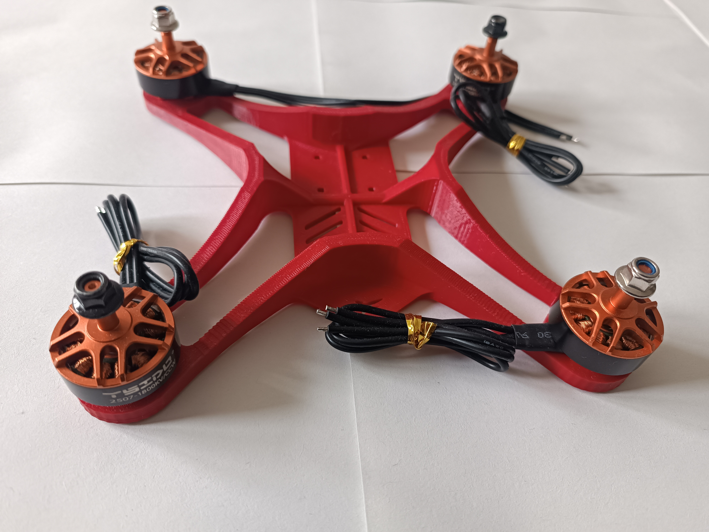
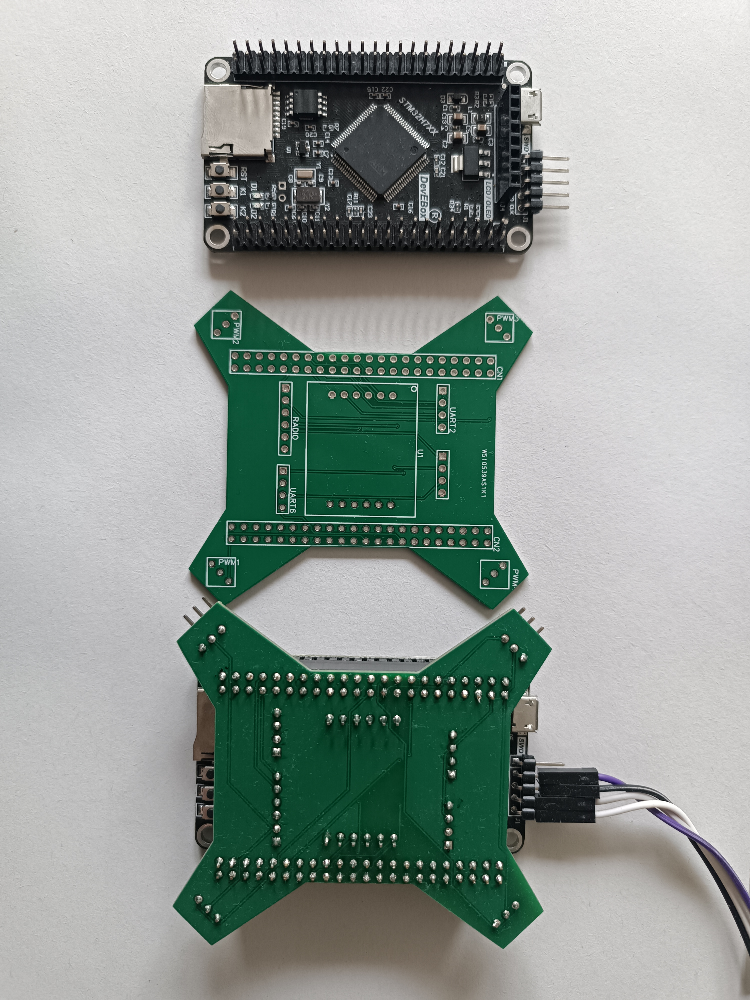

# Quadcopter Drone Flight Controller

The git branch "Arduino_version" contain the code of the working prototype running on an arduino board
The git branch "stm32_version" is work in progress. It contain the code of the new version developped on a STM32H7 microcontroller

## Overview

This repository contains the source code for a quadcopter drone flight controller developed in C++ on an STM32H7 microcontroller. Various sensors and control algorithms are used to achieve stable and responsive flight.

## Features

- **Microcontroller**: STM32H7 running at 480 MHz
- **IMU Sensor**: ICM29048  (3-axis accelerometer, 3-axis gyroscope, and 3-axis magnetometer)
- **Radio Receiver**: Reading PWM signals from 4 channels
- **ESC Control**: Generating 500Hz PWM signals for brushless motors' ESCs
- **Attitude Estimation**: Extended Kalman Filter
- **Quaternion Calculations**: To avoid gimbal lock and enable efficient spherical rotation interpolation
- **PID Controllers**: For various flight modes including stabilized, acrobatic, and GPS position mode

## AHRS (Attitude and Heading Reference System)

The AHRS fuses data from the accelerometer, gyroscope, and magnetometer using an Extended Kalman Filter to estimate the attitude of the quadcopter.

## PID Control

The project utilizes PID controllers to manage motor power in different flight modes.

- **Stabilized Mode**:
  - **Simple Attitude Control**:
    - The attitude error is fed into a PID controller, which adjusts the motor power.
  - **Cascaded Control (not yet implemented)**:
    - The attitude error is processed by a PID controller to produce an angular rate target. This target is then used as the input for another PID controller, which adjusts the motor power based on the angular rate error.

- **Acrobatic Mode (not yet implemented)**:
  - The angular rate error is processed by a PID controller to directly adjust the motor power.

## Hardware

- **Frame**: The frame is 3D printed using PLA, which offers significant rigidity. This rigidity is particularly beneficial in dampening low-frequency vibrations generated by the motors, allowing only high-frequency vibrations to pass through. The electronic components, including a highly sensitive accelerometer, are mounted using silent blocks. These silent blocks are effective in reducing high-frequency vibrations, ensuring that the accelerometer and other electronics remain stable and less affected by vibrations.

- **PCB**: A custom PCB board is made to best fit in the chassis. The IMU is solder on this PCB that plugged as a shield on the microcontroller development board.

