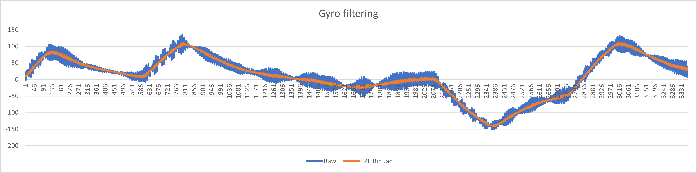
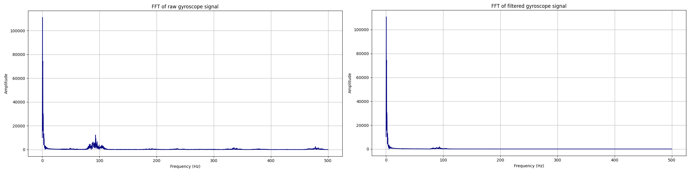
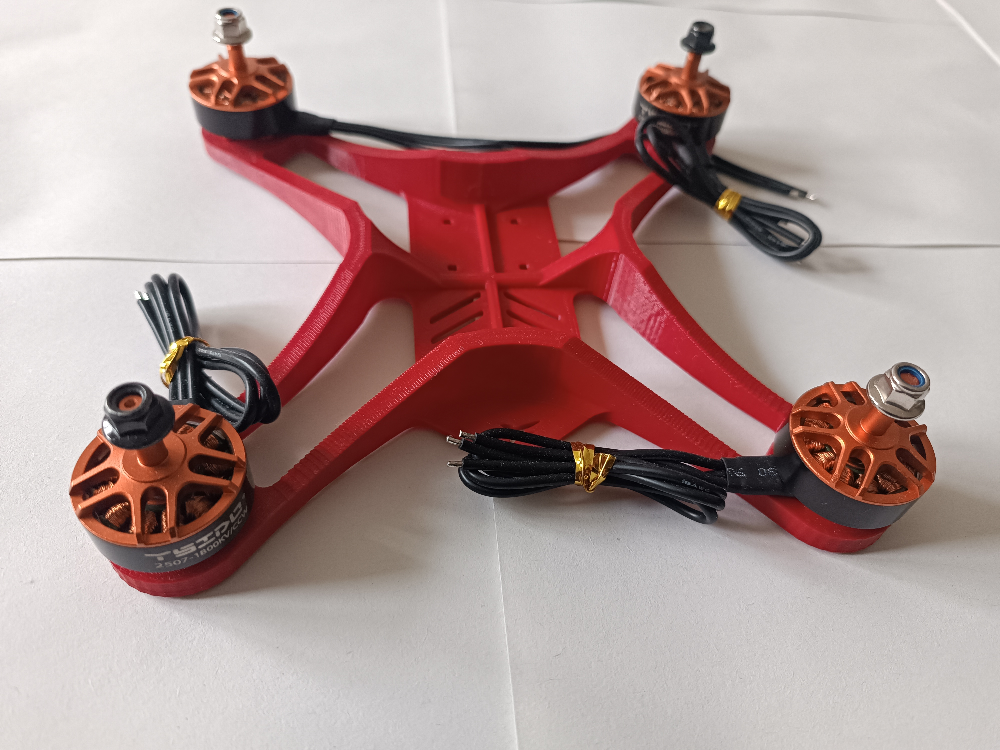
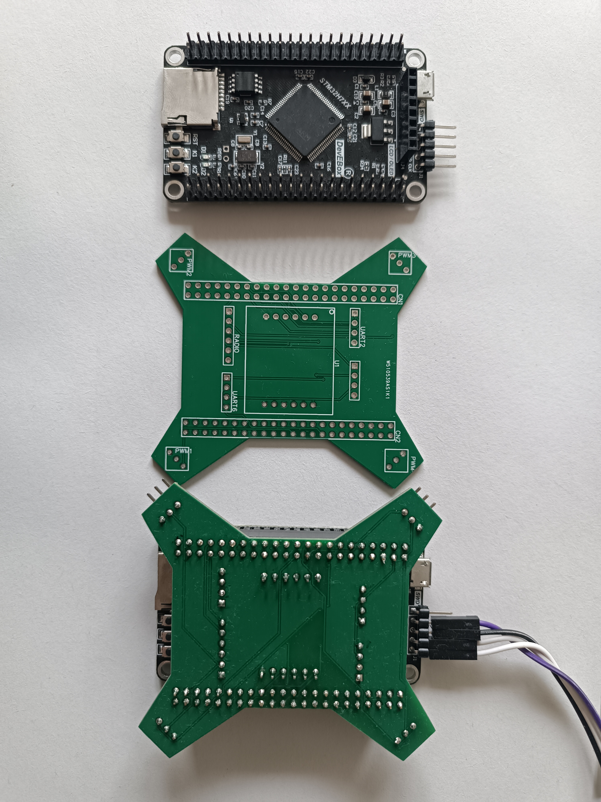

# MicroFlight - a quadcopter drone flight controller

## Overview

This repository contains the source code for a quadcopter drone flight controller developed in C++ on an STM32H7 microcontroller. Various sensors and control algorithms are used to achieve stable and responsive flight.

## Features

- **Microcontroller**: Support the STM32H7 microcontroler, running at 480 MHz.
- **IMU Sensor**: Support the ICM20948  (3-axis accelerometer, 3-axis gyroscope, and 3-axis magnetometer) IMU with SPI for fast communication.
- **Optical Flow & Lidar**: Support the MTF-01 sensor, it provide horizontal velocity and ground distance to enable position and altitude holding.
- **Radio Receiver**: Support PWM signals and Sbus protocol.
- **ESC Control**: Support 500Hz PWM generation to command the brushless motors' ESCs.
- **AHRS (Attitude Estimation)**: Use a Madgwick filter (sensor fusion) for stabilized flight mode.
- **Quaternion Calculations**: To avoid gimbal lock pitfall and enable efficient spherical rotation interpolation, quaternions are used in the entire control loop.
- **PID Controllers**: 3 PID controllers can be chained for various flight modes including stabilized, acrobatic, and position hold mode. PID coefficients can be tuned.
- **Filtering**: First order and second order low pass filter are used to filter out the noise. CutOff frequencys can be tuned.
- **Blackbox**: Data logging asynchronousely (over UART), data logging on SD card comming soon.
- **Battery Voltage Compensation**: The motors power is constently ajusted according to the battery level. Avoiding power drop at low battery.

Coming soon:
- **CLI**: Command line interface to tune radio input, PID coefficient and filters.
- **Crash Recovery**: Freefal detection and recover from it.

## Architecture Diagram

Click on it to open it on fullscreen

## Quaternions

Quaternions are used through the entire control loop.
Quaternions avoid singularities (like gimbal lock) that can occur with Euler angles, making them a robust choice for representing 3D rotations, especially in drones that can maneuver aggressively.

## AHRS (Attitude and Heading Reference System)

The AHRS fuses data from the accelerometer and gyroscope using a Madgwick filter to estimate the attitude of the quadcopter.
Madgwick filter is fast (use a gradient descent algorithm) and directly output a quaternion.

## PID Control

The project utilizes chained PID controllers to manage motor power in different flight modes.

- **Stabilized Mode**:
  - **Cascaded PIDs for Attitude Control**:
    - Attitude setpoint -> [PID Attitude] -> Rate setpoint -> [PID Rate] -> Torque vector -> [Mixer]
    - The attitude error is processed by a PID controller to produce an angular rate target. This target is then used as the input for another PID controller, which compute the torque vector.

- **Acrobatic Mode**:
  - Rate setpoint -> [PID Rate] -> Torque vector -> [Mixer]
  - The angular rate error is processed by a PID controller to directly compute the torque vector.

- **Position Hold Mode**:
  - Position Setpoint -> [PID Position] -> Attitude setpoint -> [PID Attitude] -> Rate setpoint -> [PID Rate] -> Torque vector -> [Mixer]
  - The position error is processed by a PID controller to produce an attitude target. Then the attitude error is processed by a PID controller to produce an angular rate target. Finally this rate target is used as the input for rate PID controller, which compute the torque vector.

## Mixer

The mixer is responsible for translating the desired thrust and torque commands into individual motor power levels. This is achieved through a linear transformation that accounts for the drone's geometry and motor configuration.

### X-Configuration Mixing
In the X-quad configuration, the mixer computes the motor outputs based on a target thrust (T) and torques around the three body axes (tx, ty, tz).

### Voltage Compensation
Motor commands are adjusted based on the battery voltage to maintain consistent thrust even as the battery discharges. Since thrust is proportional to the square of the voltage, a quadratic compensation is applied. A low-pass filter smooths the ADC readings to avoid abrupt changes.

### Clamping and Rescaling
To ensure motor outputs remain within the valid range [0, 1000], the mixer applies a rescaling procedure. If any motor command falls outside this range, all outputs are linearly scaled to preserve the relative distribution while ensuring no negative or overdriven values.
This ensures the drone maintains maneuverability even when operating at or near full throttle, by preserving control authority through motor power rescaling.

## Finite State Machines

## Filtering
Filtering noise is a crucial part of a flight controler. Motors and propellers generates a lot of vibrations that propagate to the IMU that is highly sensitive to it. Silent blocks help mechanicaly reduce it but a proper filtering is still mandatory.
The graph below show the raw gyroscope data (blue line) of the pitch axis with the motors running at around 40% of their power, and the filtered data (orange line).
The filter is a second order low pass filter (biquad Butterworth) with a 75Hz cutoff frequency. 

The two graphs below are the fast Fourier transform (FFT) of the gyroscope data of the pitch axis with the motors at 40% of power. On the left the FFT of the raw unfiltered data is shown, on the right the FFT of the filtered data.

The big spike at 0-20 Hz is due to the drone's movement. The spikes at around 100Hz and beyond are noise and its harmonics. The second order low pass filter show a huge effect at reducing the noise.

## Hardware

- **Frame**: The frame is 3D printed using PLA, which offers significant rigidity. This rigidity is particularly beneficial in dampening low-frequency vibrations generated by the motors, allowing only high-frequency vibrations to pass through. The electronic components, including a highly sensitive accelerometer, are mounted using silent blocks. These silent blocks are effective in reducing high-frequency vibrations, ensuring that the accelerometer and other electronics remain stable and less affected by vibrations.

- **PCB**: A custom PCB board is made to best fit in the chassis. The IMU is solder on this PCB that plugged as a shield on the microcontroller development board.

